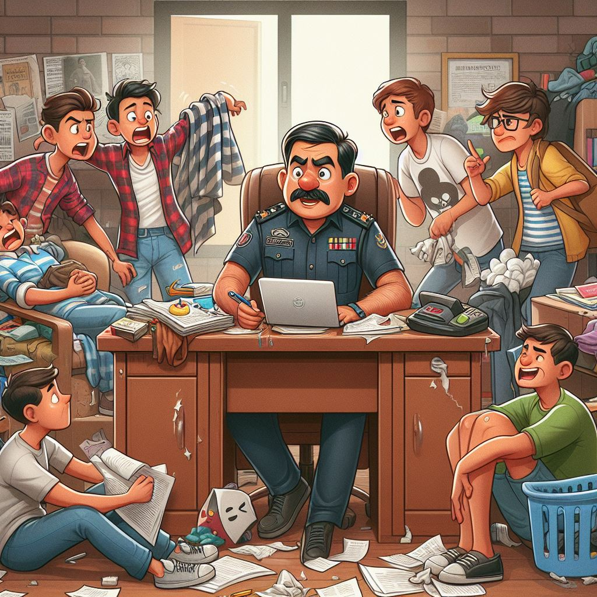
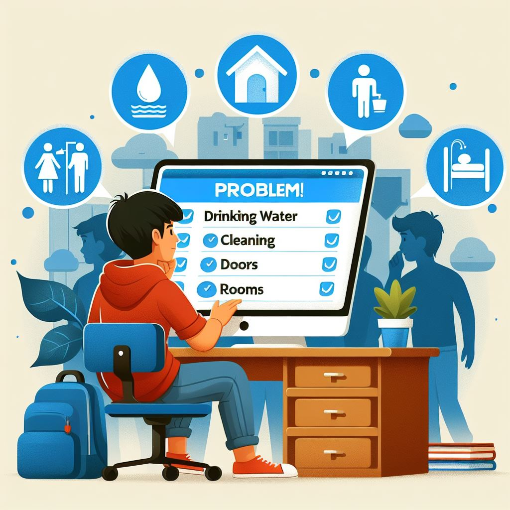

# Aadhya_2k24_code_samurai
Student problems addressing website by team Code Samurai
# Overview
We crafted a website to address the problems of hostel students to Hostel Authorities in a modernised way.We created a Home Page after Login It redirects to the main page consists of already raised problems and their status and a button to raise a new problem.
# Approach/ How The website works:
    • Opens the home page then it asks for whether he is student or Hostel authorities  and then sign in( Id and Password)
    • It opens a dashboard where user can see his previous complaints and their status, his profile and option to “Raise a complaint”
    • After clicking , it will open a form where user has to Select following options:
        1.Whether the problem is related to whole floor or Student
        2.Under floor problems he can select what his problem related to,from options like Electrical,Wifi,House Kepping,Drinking water,Washrooms etc.
        3.Under Student he can select problems like Electrical,Windows,Doors,others.
    • Then he can also express his problems in a Text Area given.
    • After clicking submit the problem is raised and is visible for the Hostel Authorities.
# Technologies used
Html,CSS,Flask,SQL Alchemy, JavaScript
# Changes brought by this idea

<table style="align-items:center; text-align:center">
<tr>
<td>
Before
</td>
<td>
After
</td>
</tr>
<tr>
<td>

</td>
<td>

</td>
</tr>
</table>

